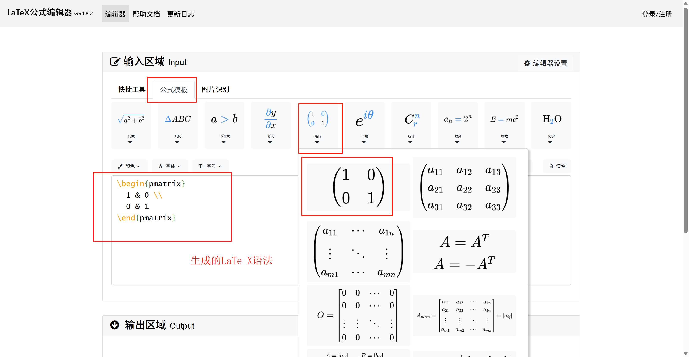

# Mathlive Demo with Vue 3 + TypeScript + Vite

这是一个基于 [Mathlive](https://github.com/arnog/mathlive) 的简单演示项目，展示了如何在 Vue 3 中集成 `<math-field>` 数学公式编辑器，并输入常见 LaTeX 数学表达式。

## ✨ 项目特点

- 使用 `mathlive` 实现网页上的数学公式输入；
- 支持常见的 LaTeX 语法；
- 使用 Vue 3 `<script setup>` + TypeScript 编写；
- 展示多个公式编辑框案例；
- 提供了资源链接和 Mathlive 基本用法说明。

## 📦 安装依赖

```bash
npm install
# 或使用 pnpm/yarn
pnpm install
```

## 🚀 启动项目
```bash
npm run dev
```

## 🧪 示例页面说明
页面中展示了以下内容：
- Mathlive 简介及功能说明；
- math-field 的使用案例：

``` html
<!-- 最简单的数学表达式：x + 1 -->
<math-field>x+1</math-field>

<!-- 表达一个函数 f(x) = x + 1 -->
<math-field>f(x)= x+1</math-field>

<!-- 一元二次方程的求根公式（经典的 quadratic formula）：
     x = [-b ± √(b² - 4ac)] / (2a) -->
<math-field>
  x=\frac{-b\pm\sqrt{b^2-4ac}}{2a}
</math-field>

<!-- 定积分表达式：从 a 到 b 对 f(x) 积分 -->
<math-field>
  \int_{a}^{b} f(x)\,dx
</math-field>

<!-- 2x2 矩阵表示 -->
<math-field>
  \begin{bmatrix}
    a & b \\
    c & d
  \end{bmatrix}
</math-field>

```
如果你想尝试更多 LaTeX 数学语法：
可以使用LaTeX Live 在线编辑器自动生成：
👉[ https://cortexjs.io/mathlive/guides/latex/#supported-latex-commands](https://www.latexlive.com/##)



## 📚 相关资料 
- [官网文档: https://cortexjs.io/mathfield/](https://cortexjs.io/mathfield/)
- [GitHub 仓库: https://github.com/arnog/mathlive](https://github.com/arnog/mathlive)
- [中文文章推荐: https://juejin.cn/post/7331577745108975666](https://juejin.cn/post/7331577745108975666)
- [LaTeX Live 在线编辑器：https://cortexjs.io/mathlive/guides/latex/#supported-latex-commands](https://cortexjs.io/mathlive/guides/latex/#supported-latex-commands)

## 📌 LaTeX 表达式示例
```latex
x = \frac{-b \pm \sqrt{b^2 - 4ac}}{2a}
```
这是经典的一元二次方程求根公式，用于展示 Mathlive 对 LaTeX 的支持。